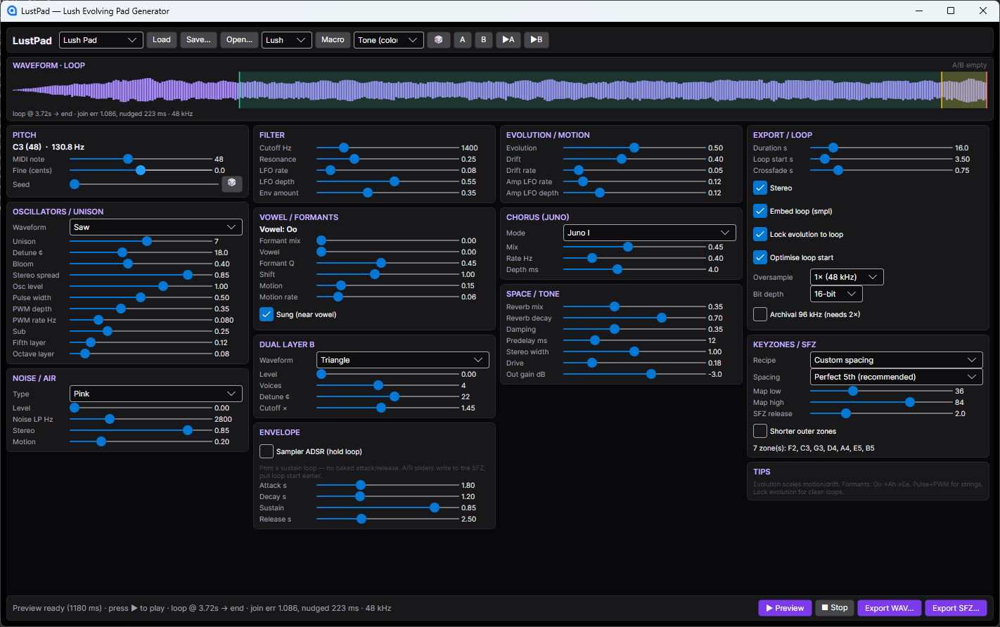

# LustPad

**Offline lush pad laboratory → looped sample library.**

**C# / .NET** desktop app built with [Avalonia UI](https://avaloniaui.net/) (cross-platform XAML UI for .NET — similar spirit to WPF). Single-screen tool for designing **evolving pad** sounds and exporting them as sampler-ready **WAV** files (and multi-zone **SFZ** instruments). Synthesis is fully **offline**: print quality first, then ship cheap-to-play samples.

The product name is playful (**LustPad**); the sonic goal is **lush**.



---

## Features

### Sound design
- Unison oscillator bank (saw / square / triangle / sine / mixed / **pulse**) with polyBLEP edges
- **Edge-weighted detune** (voices stack toward ±cents, centre stays put) and **Bloom** (outer voices fade in before loop start)
- **Pulse width + PWM** (depth / rate, loop-lockable) for stringy, living pads
- **Osc level** plus sub, fifth, and octave layers
- **Dual Layer B** — second detuned stack with its own cutoff colour
- Noise / air (white, pink, brown) with dedicated LP, stereo decorrelation, and motion
- Resonant low-pass, slow LFOs, pitch drift, amplitude “breathing”
- **Formants** (Oo → Ah → Ee): vowel resonators + tilt, mixed with the normal filtered pad; optional *sung* motion
- **Juno-style chorus** (modes I / II / I+II), longer modulated FDN reverb (predelay + damping), mid/side stereo width, soft drive
- Character macros: **Lush · Dark · Airy · Vocal**
- Scoped **randomize** (tone / motion / space / subtle) — never touches note, duration, loop, or export structure

### Looping & quality
- Loop end = end of file; onset lives before **loop start**
- **Sampler ADSR (hold loop)** — print a constant-sustain loop; attack/release go to the SFZ instead of the WAV
- **Lock evolution to loop** — LFO / PWM / motion / chorus-mode / reverb-mod rates snap to whole cycles over the loop body
- Loop-start optimisation + equal-power crossfade (end blended to pre-loop lead-in for seamless wrap)
- DC / sub-Hz blocker on the render path (cleaner loops and exports)
- Optional **2× oversampling** (96 kHz render → 48 kHz via Kaiser-sinc downsample), **24-bit** export, **96 kHz archival**
- Waveform overview with loop / crossfade markers and join-error readout
- **Background preview render** — loading a preset or changing controls pre-renders so ▶ is ready when you are

### Library export
- Single WAV with embedded **`smpl`** loop points
- **SFZ** folder export: multi-root keyzones, named recipes (formant-dense / drone / full fifths), optional shorter outer zones
- JSON presets (`.lustpad.json`); A/B compare two full patch snapshots

With **Sampler ADSR** on, both attack and release are left to the sampler. Off (default), attack is still printed and only release is sampler-side.

---

## Requirements

- **C# / [.NET 10 SDK](https://dotnet.microsoft.com/download)** (or compatible)
- **[Avalonia](https://avaloniaui.net/)** UI (pulled in via NuGet with the project)
- Windows recommended for NAudio preview (WinMM); Avalonia itself is cross-platform

---

## Quick start

Windows build (no compile): grab the zip from [Releases](https://github.com/bigdevelopments/LustPad/releases) and run `LustPad.exe`.

```powershell
git clone https://github.com/bigdevelopments/LustPad.git
cd LustPad
dotnet build LustPad.slnx
dotnet run --project LustPad.App
```

Tests:

```powershell
dotnet test LustPad.Core.Tests
```

---

## Solution layout

| Path | Role |
|------|------|
| `LustPad.slnx` | Solution |
| `LustPad.App/` | Avalonia UI, NAudio preview, ViewModels |
| `LustPad.Core/` | Synthesis, loop processor, WAV writer, SFZ exporter, macros |
| `LustPad.Core.Tests/` | Unit tests on the real render/export path |
| `samples/` | Optional local example renders (not required to build) |

---

## Typical workflow

1. Load a built-in (**Ooh Choir**, **Ahhh Pad**, **Lush Pad**, …), open a `.lustpad.json`, or start from scratch  
2. Wait for status **Preview ready** (render runs in the background)  
3. Set **MIDI note**, duration, and loop start (after the onset / FX settle)  
4. Shape tone (filter, formants, noise, Layer B, Juno chorus, space) — each change re-preps the preview  
5. **▶ Preview** (software-looped) — check waveform markers / join error  
6. **Export WAV…** or **Export SFZ…** for a multi-sample map  
7. In your sampler: loop continuous; shape amp attack/release to taste  

**Tips**
- Formant mix blends the **normal pad path** with the **vowel path** — raise mix, then sweep vowel (Oo ↔ Ah ↔ Ee).  
- **Sampler ADSR** prints a hold loop (pull loop start in to ~0.4–0.8 s). Leave it off if you still want a baked swell.  
- Bloom is unison onset only; it always finishes before loop start.  
- Formant / evolving pads want denser keyzones (minor 3rd / 4th); simple drones tolerate fifths or octaves.  
- Pitch stretch speeds up evolution when using one sample across the keyboard.

---

## Architecture (why offline)

Realtime synths fight latency and CPU every note. LustPad **renders offline**, so it can afford:

- Fat unison + dual layer + formants + a long modulated reverb  
- Juno-style BBD chorus and loop-period locking  
- Loop-point search and seamless end↔lead-in crossfade  
- Oversampled print-down to 48 kHz (Kaiser-sinc)  

You pay disk for multi-samples; play time stays cheap (sampler just loops PCM).

---

## Credits

**Designed and built with [Grok](https://x.ai/)** (xAI) in a hands-on pair-programming session — architecture, synthesis engine, Avalonia UI, loop continuity, SFZ export, and the “offline pad factory” workflow.

- **Human direction:** product vision, sound goals (lush pads, ooh/ahh, sample-library use), taste and iteration  
- **Grok:** implementation across `LustPad.Core` / `LustPad.App`, DSP details, export tooling, and tests  

Libraries we lean on:

- [Avalonia UI](https://avaloniaui.net/) — desktop shell  
- [NAudio](https://github.com/naudio/NAudio) — Windows preview playback  
- [CommunityToolkit.Mvvm](https://github.com/CommunityToolkit/dotnet) — ViewModel plumbing  

---

## License

[MIT](LICENSE) — free to use, modify, and redistribute, including commercially, with attribution.

---

## Status

Actively useful for sketching and exporting pad libraries. Not a realtime instrument plugin. Contributions and forks welcome.
